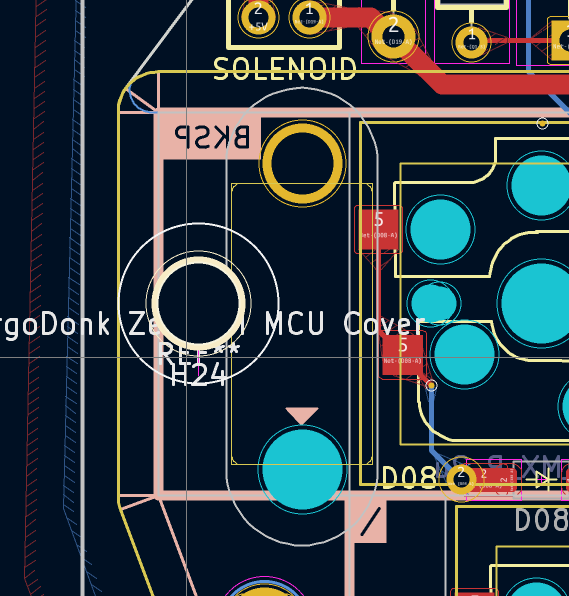
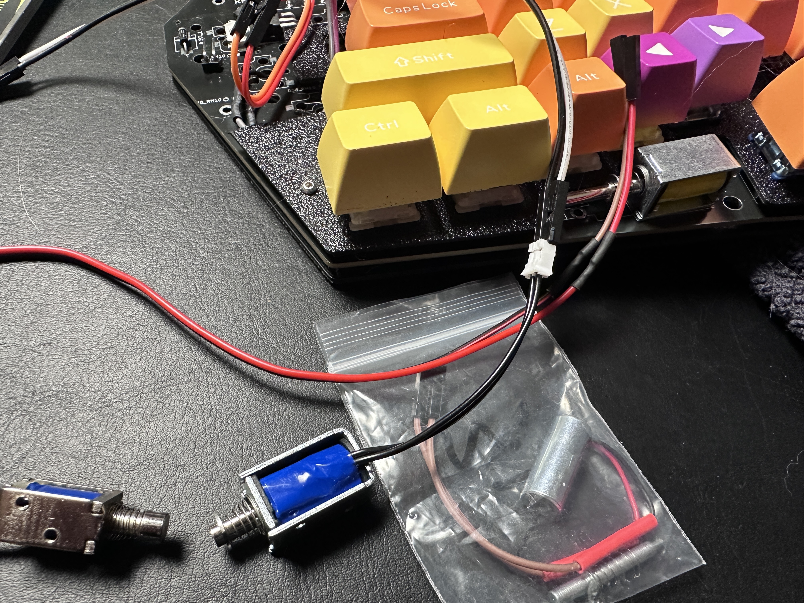

## Build log:
### v0.1
* 11-20-2023 Sent out v0.1 to JLC for production
* Split off from the main ErgoDonk development repo for easier cleanup/maintenance.

### v0.2
* Confirmed v0.1 works as expected.
* Put a GND plane on both sides, wire VCC directly. (with big fat traces)!
* Added jumper jig to help bend jumper bridges.
* Move all traces from pads to the corners to prevent acid traps.
* Fix jumper bay graphics
* Changing pad connections on Polygons to 'Solid' - might be a bit harder to solder, but leads to better connections.
* Added key cap labels to each key.
* Increased key outlines and solenid component silks for improved legibility.
* Added key plate layer with stabilizer cutouts.
* **3.7795** is the keyplate multiplier when creating Fusion 360 imports
* Moved rotary encoder column up 2.5mm to avoid hitting encoder with my freakishly long thumbs.
* Added plates for RH/LH MCU Covers
* Moved mounting holes for MCU Covers
* Moved thumb 2u key diodes down to prevent stabilizer interference.
* Added markings to indicate stabilizer holes per side.
* Fixed protruding 'trace nub' on main footprint

* Moved all diodes down a bit to make more room for choc keys
* Considered moving TRRS jack below vol buttons. Decided against it, as i like to keep things between the two halves of the keyboard, so keeping the cables higher up is preferred.
* Converted TRRS jack to TRS. 
* Refactored TRRS jack to remove full duplex. Replaced with serial default. Rerouted accordingly - then rolled it all back. I think it's better to leave the config for Full duplex available, but only implement serial communication. The full duplex config will probably be used in other ergodonk variants, and there is no urgent need for freeing up that extra pin.
* Via support added. It's on branch ergodonk_zero: https://github.com/JellyTitan/keyboards/blob/ergodonk_zero/v3/ergodonk_zero/ergodonk_zero.json
* Hid the case mount holes where possible. Where not possible, made them appear balanced & intentional.
* Ordered v0.2 PCB 1-11-2024.
* Ordered v0.2 Acrylic cases 1-12-2024

### v0.2.1
- Created footprints for plates. (key plate, back plate, MCU Covers Left & Right, and Solenoid cover).
- Removed solenoid outline on the LH top silks layer. I like the look better without the outline.
- Fixed unmasked nub on the switch footprint for connecting front/back.
- Added Tip120 bending jig.
- 
- [x] Verified the TRRS/TRS jack works as expected. ()
- [x] Convert QMK config to Serial from full duplex.
- [ ] There may be a problem with the leftmost post hole intersecting the stabilizer:

* Tried some alternate Solenoids. [This one from Sparkfun](https://www.sparkfun.com/products/11015) did not work. These [little](https://www.aliexpress.us/item/3256802092636163.html) [3V Solenoids](https://www.aliexpress.us/item/3256801967962531.html?spm=a2g0o.order_list.order_list_main.15.124c1802EEEXaw&gatewayAdapt=glo2usa) from Aliexpress did work, but the 'thunk' was not nearly as satisfying. I suspect the solenoid is not actually getting a Solid 5V. The [4.5V Uxcell Solenoid](https://www.amazon.com/gp/product/B013DR655A) initially recommended in the Red Herring seems to be the most forgiving of the under-voltage. Making that my official recommendation. 

* Found another Soleniod on AliExpress that works, and added it to the BOM.
* The tenting puck did not work with MX footprints - it intersected the switch sockets. I added a second tenting puck, now there's one for choc and one for MX.

## Punch list
* [ ] Validate the new and old tenting puck holes are good.
* [ ] consider a key plate variant that has holes to attach a top plate. 
* [ ] Try putting a smaller 3v Solenoid on each hand.

* [ ] Note look for socket outline when placing switches per hand. An earlier note referenced looking for pads, it’s easier to find outlines and pads.
* [ ] After you finish, tacking down the first side of the sockets, give the board of gentle tap to see if anything shakes loose. It’s better to find weak solder joints now than later. Then rotate the board 180 and solder the other one.
* [ ] Make a note about tacking down, one side, rotating, and then soldering the other side of the socket switches. There’s images for these.
* [ ] Add notes to the build guide, about how the symbols on the key cap should not correspond to the actual key presses., and the default layout is an adaptation of the ergodox.
* [ ] Add note about how great those magnetic data cables are.
* [ ] Add note in the build guide about the key layout using the ergonomic height of the SA keys and add images demponstrating. Also add a keyboard layout editor.com variant with the Row #'s.'
* [ ] Add a link to make it easy for users to contribute to documentation, like QMK has.
* [ ] Add note about the merits of AliExpress vs other vendors.
* [ ] Consider creating a choc key plate variant with cutouts for the diodes on the front?
* [ ] fix hot swap socket graphic with iconography. (Currently two red arrows - maybe a green check and a red 'no')?
* [ ] Create a tip120 bending jig.
* [ ] Strip GEO metadata from all images.
* [ ] Add diode punch outs for the bending jigs.
* [ ] Review pitch and tilt angle origion for ergo case. If the origin is the center of the board as opposed to the edge, what does that change?
* [ ] When using PCBA, all the matrix intersections will get a diode. I think this is what's breaking the handedness by matrix intersection setting in QMK. Consider add a jumper for the RH Backspace key, so that even if PCBA is used, the handedness detcetion by matrix intersection will still work.
* [ ] Use the Zero LED as a layer indicator. Example qmk_firmware/keyboards/handwired/alcor_dactyl
* [ ] Update case to include hole above layer indicator LED. 
* [x] Adjust key labels before production. (There are a few under holes)
* [ ] Before submitting QMK PR, update version number in `info.json`
* Add Solenoid installation to the README

## Features to add to future keyboards
* Space 2mm and 4mm case holes evenly around the perimeter for monoblock type cases.
* Consider moving TRS and Zero jack back a bit so they sit flush with the edge of the board. This would make it easier to use 'monoblock' cases.
* Be sure to rotate the thumb cluster keys when building a LED variant.