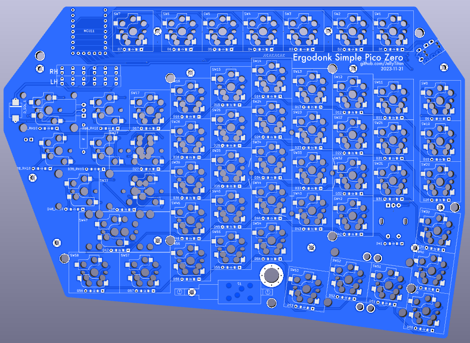

# ErgoDonk-Simple-Zero
ErgoDonk keyboard variant that is double sided &amp; uses RP2040 Zero MCU

## Design philosophy
The ErgoDonk Simple Zero is designed with the following goals:

* Comfort
  * Ortholinear, split & tiltable.
* Powerful
  * The RP2040 Zero is a vast improvement over the commonly used ProMicero MCU
* Low cost
  * The PCB is reversible to reduce manufacturing costs.
  * Uses RP2040 Zero. (Inexpensive clones are readily available through Alixpress for ~$3USD)
* Simplicity
  * Supports more keys than a traditional split ergo, making it a good transition to a smaller split, or for those who really like their "F" keys.
* Ease of build
  * Through hole components are available in lieu of SMD when avaiable.
* USB-C

## Build log:
### v0.1
* 11-20-2023 Sent out v0.1 to JLC for production
* Split off from the main Ergodonk development repo for easier cleanup/maintenance.

### v0.2
* Confirmed v0.1 works as expected.
* 
* Added jumper jig to help bend jumper bridges.

## Punch list
* Put a GND plane on both sides, wire VCC directly. (with big fat traces)!
* Move all traces from pads to the corners to prevent acid traps.
* add holes between the jumpers so a row of header pins can be used.
* Separate the Zero power traces to the right of the footprint. (Too close together)
* Fix jumper bay graphics
* Add usb option to the TRRS jack.
* Add mur3xx to the BOM after validating the Solenoid circuit
* Improve the key outlines
* Add a "letter" indicator per key? (Can this be tied to schematic variables?)
* move the knob column up a tiny bit, keep hitting it with my thumb.
* Fix 'pad nub' on main switch footprint
* Consider changing pad connections on Polygons to 'Solid' - might be a bit harder to solder, but leads to better connections.
* Add note about jumper jig in build guide.

